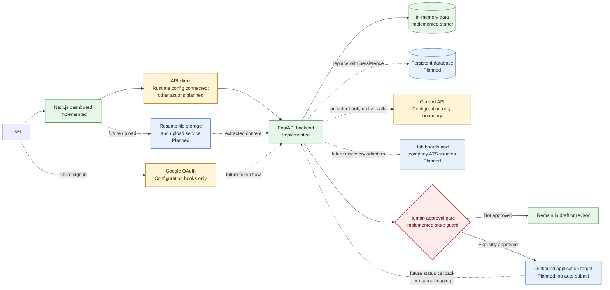

# RoleReady System Diagrams

These diagrams describe the current starter and its intended direction. Green nodes are implemented today, amber nodes are partial or configuration-only, blue nodes are planned, and the red node is the required human approval gate.

## Diagram 1: User Journey & Application Flow

The dashboard is usable as a review workspace, but most controls currently display editable mock data. The frontend API client fetches runtime configuration today; full workflow wiring and resume upload are planned. The backend already enforces `draft -> review -> approved`, and there is no automatic submission.

```mermaid
flowchart LR
    U[User] --> UI
    UI --> UP[Upload resume or blueprint<br/>Planned]
    UP --> EX[Extract skills, experience,<br/>role and work preferences<br/>Agent interface exists; upload planned]
    EX --> PR[Review and edit extracted profile<br/>UI and workflow planned]
    PR --> CF[Configure profile fields,<br/>platforms and companies]
    CF --> DISC[Discover and score jobs<br/>Placeholder discovery today]
    DISC --> GEN[Generate tailored resume<br/>and application draft<br/>Safe placeholder today]
    GEN --> REV[Review each application]
    REV --> GATE{Explicit human approval<br/>required}
    GATE -->|Needs changes| GEN
    GATE -->|Approved| HANDOFF[Approved handoff only<br/>No automatic submission]
    HANDOFF --> EXT[User submits to employer<br/>Planned external workflow]
    EXT --> LOG[Log submitted status<br/>Planned]

    subgraph Frontend[Next.js Frontend]
        UI[RoleReady Dashboard<br/>Implemented UI]
        CLIENT[Frontend API client<br/>Config fetch implemented;<br/>workflow wiring planned]
        UI --> CLIENT
    end

    subgraph Backend[FastAPI Backend]
        ROUTES[Profile, jobs and<br/>application routes]
        PROFILE[(Configuration and<br/>profile data in memory)]
        AGENTS[Agent service boundary]
        APPROVAL[Approval state guard<br/>draft to review to approved]
        ROUTES --> PROFILE
        ROUTES --> AGENTS
        ROUTES --> APPROVAL
    end

    CLIENT -. HTTP .-> ROUTES
    CF -. saved through planned UI wiring .-> ROUTES
    DISC -. backend service .-> ROUTES
    GEN -. backend service .-> AGENTS
    GATE -. enforced by .-> APPROVAL

    classDef implemented fill:#e8f5e9,stroke:#2e7d32,color:#17351b;
    classDef partial fill:#fff4d6,stroke:#a66b00,color:#4f3500;
    classDef planned fill:#e8f1fb,stroke:#326da8,color:#173753;
    classDef gate fill:#fdeaea,stroke:#b3261e,color:#5f1713,stroke-width:2px;
    class UI,ROUTES,PROFILE,APPROVAL implemented;
    class CLIENT,CF,DISC,GEN,AGENTS partial;
    class UP,EX,PR,EXT,LOG,HANDOFF planned;
    class GATE gate;
```



## Diagram 2: Backend Services & Agent Flow

FastAPI routes call small services backed by an in-memory starter store. Agent selection is controlled by environment configuration, but both branches currently return safe local placeholder output; live OpenAI SDK calls are not yet implemented.

```mermaid
flowchart TB
    ENTRY[FastAPI entrypoint<br/>app.main] --> HEALTH[GET /health]
    ENTRY --> ROUTER[/api router]

    ROUTER --> AUTH[Auth routes<br/>Local login scaffold<br/>Google config hook]
    ROUTER --> PROFILE[Profile routes<br/>GET and PUT]
    ROUTER --> CONFIG[Config route<br/>Runtime feature flags]
    ROUTER --> JOBS[Jobs routes<br/>List and discover]
    ROUTER --> APPS[Application routes<br/>List, draft, review,<br/>approve, mark draft]

    PROFILE --> STORE[(In-memory starter store<br/>Profile, jobs, applications)]
    JOBS --> DISCOVERY[Job discovery service]
    DISCOVERY --> STORE
    APPS --> APPLICATION[Application service]
    APPLICATION --> STORE

    APPLICATION --> DRAFT[Draft]
    DRAFT --> REVIEW[Review]
    REVIEW --> STATE_GATE{confirmed true?}
    STATE_GATE -->|No| REVIEW
    STATE_GATE -->|Yes| APPROVED[Approved]
    APPROVED --> RULE[No submitted state<br/>and no auto-submit]

    DISCOVERY --> AGENT[Agent service boundary]
    APPLICATION --> AGENT
    AGENT --> EXTRACT[Resume extraction interface]
    AGENT --> MATCH[Job match scoring]
    AGENT --> TAILOR[Resume tailoring]
    AGENT --> WRITE[Answer and cover-letter drafting<br/>Cover note included today]

    ENV{OPENAI_API_KEY present?} -->|No| PLACEHOLDER[Safe placeholder agent<br/>Implemented default]
    ENV -->|Yes| OPENAIHOOK[OpenAI provider hook<br/>Configuration-only]
    PLACEHOLDER --> AGENT
    OPENAIHOOK --> NOTE[Currently inherits<br/>placeholder behavior]
    NOTE --> AGENT
    OPENAIHOOK -. future SDK calls .-> OPENAI[OpenAI API<br/>Planned live integration]

    classDef implemented fill:#e8f5e9,stroke:#2e7d32,color:#17351b;
    classDef partial fill:#fff4d6,stroke:#a66b00,color:#4f3500;
    classDef planned fill:#e8f1fb,stroke:#326da8,color:#173753;
    classDef gate fill:#fdeaea,stroke:#b3261e,color:#5f1713,stroke-width:2px;
    class ENTRY,HEALTH,ROUTER,PROFILE,CONFIG,JOBS,APPS,STORE,DISCOVERY,APPLICATION,DRAFT,REVIEW,APPROVED,AGENT,EXTRACT,MATCH,TAILOR,WRITE,PLACEHOLDER implemented;
    class AUTH,ENV,OPENAIHOOK,NOTE partial;
    class OPENAI planned;
    class STATE_GATE,RULE gate;
```

## Diagram 3: Systems Integration Map

Only the Next.js-to-FastAPI runtime configuration call and the local backend workflow are connected today. External identity, AI, storage, discovery, persistence, and submission integrations are either configuration-only or planned.


